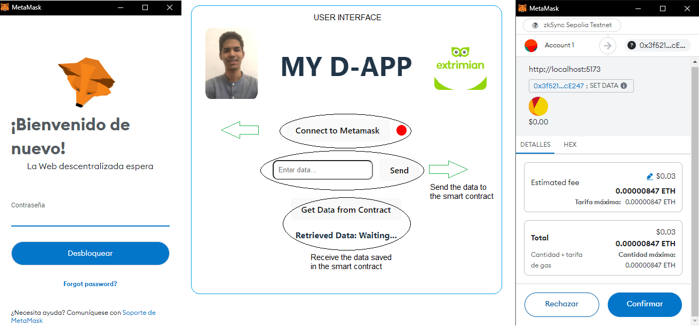

# D-APP (CHALLENGE)

## Descripción

Esta DApp permite al usuario almacenar y recuperar datos en la cadena de bloques mediante un contrato inteligente implementado en una red de prueba (Zksync Sepolia Testnet). Los usuarios pueden conectarse a MetaMask, enviar datos al contrato y recuperar datos del mismo. La interfaz de usuario está desarrollada en Preact, mientras que el contrato inteligente está escrito en Solidity.

## Diagrama de la aplicación



## Tecnologías involucradas

- Preact (Vite): Framework de JavaScript para el frontend, elegido por ser más liviano que React e ideal para el tamaño del proyecto.
- Solidity: Lenguaje de programación para realizar smart contracts.
- Ethers.js: Biblioteca para interactuar con la blockchain, elegida sobre Web3.js por estar principalmente diseñada para trabajar con smart contracts.
- MetaMask: Wallet para firmar transacciones.
- Atlas: IDE para escribir, probar y desplegar smart contracts.
- Zksync Sepolia Testnet: Red blockchain para desplegar y probar el contrato.

## Implementación

### Pasos para instalar y desplegar:

#### 1. Clonar el repositorio

Primero, clona el repositorio en tu máquina local.

```
git clone https://github.com/Davidoar15/DAPP-Smart-Contract-Challenge.git
cd DAPP-Smart-Contract-Challenge/client
```

#### 2. Instalar dependencias

Usa `yarn` o `npm` para instalar las dependencias del proyecto.

```
yarn install
```

#### 3. Compilar el contrato inteligente

Utilizar Atlas (recomendado) para desplegar el contrato inteligente:

1. Abrir Atlas IDE en tu navegador.
2. Cargar el archivo del contrato (`SimpleStorage.sol`) en Atlas.
3. Compilar el contrato.
4. Desplegar el contrato en una testnet (Zksync Sepolia Testnet).

#### 4. Actualizar la dirección del contrato (contractAddress) y el ABI

Después de desplegar el contrato, copia la dirección del contrato y actualiza el archivo `consts/index.js` con la nueva dirección del contrato y el ABI generado.

#### 5. Ejecutar la aplicación

Inicia la aplicación con `yarn` o `npm`:

```
yarn run dev
```

#### 6. Conectar MetaMask

Asegúrese de que la extensión MetaMask esté instalada en su navegador y que está conectado a la misma red de prueba (testnet) en la que ha desplegado el contrato.

#### 7. Interacción

1. Abra su navegador y vaya al puerto que `yarn run dev` indique.
2. Conecta MetaMask a la aplicación usando el botón "Connect to MetaMask".
3. Ingresa un dato en el campo de entrada y haz clic en "Send Data" para almacenar el dato en el contrato.
4. Haz clic en "Get Data from Contract" para recuperar el dato almacenado en el contrato.

## Documentación auxiliar

Para informarse aún más sobre la implementación de los smart contracts y/o la testnet, puede consultar los siguientes enlaces.

- https://docs.zksync.io/ecosystem/network-faucets
- https://docs.zksync.io/build/quick-start/deploy-your-first-contract
- https://youtu.be/I_OZd0HN7ro?si=Cg9Vmull_J-cHz6i

## Gracias por Leer